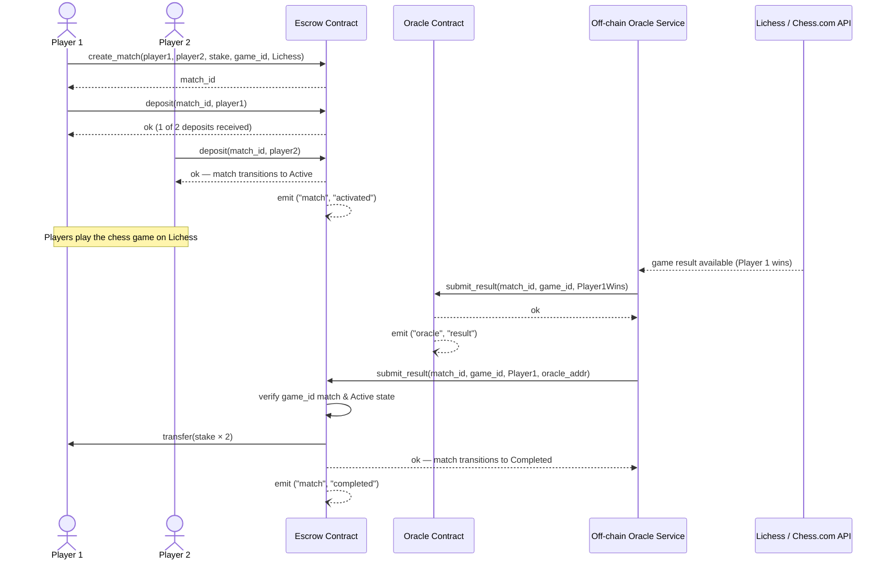
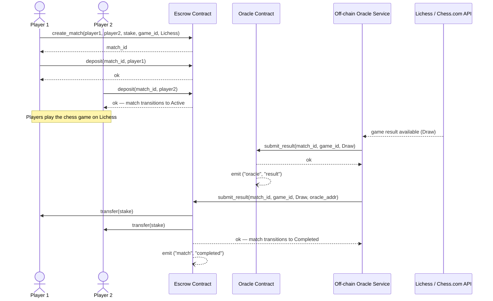

# Architecture Overview

## System Components

smile4money is composed of two Soroban smart contracts and an off-chain oracle service.

```mermaid
flowchart TD
    P1[Player1]
    P2[Player2]
    FE[Frontend]
    EC[Escrow Contract<br/>Soroban]
    OC[Oracle Contract<br/>Soroban]
    OOS[Off-chain Oracle<br/>Service]
    LA[Lichess API]
    CA[Chess.com API]

    P1 -->|interacts| FE
    P2 -->|interacts| FE

    FE -->|create_match<br/>deposit<br/>cancel_match| EC

    OOS -->|GET /api/game/{id}| LA
    OOS -->|GET /pub/player/{user}/games| CA
    LA -->|game result| OOS
    CA -->|game result| OOS

    OOS -->|submit_result<br/>match_id, game_id, result| OC
    OOS -->|submit_result<br/>match_id, game_id, winner, caller| EC

    EC -->|payout<br/>stake_amount × 2| P1
    EC -->|payout<br/>stake_amount × 2| P2
```

## Match Lifecycle

```
create_match()
     │
     ▼
  Pending ──── deposit(player1) ──── deposit(player2) ──── Active
     │                                                        │
  cancel_match()                                    submit_result()
     │                                                        │
  Cancelled                                              Completed
```

State transitions are enforced on-chain. Deposits are rejected for any state other than `Pending`. Results are rejected for any state other than `Active`.

## Contract Storage

### Escrow Contract

| Key | Storage | Description |
|-----|---------|-------------|
| `DataKey::Oracle` | Instance | Trusted oracle address |
| `DataKey::Admin` | Instance | Admin address for pause/unpause |
| `DataKey::MatchCount` | Instance | Monotonic match ID counter |
| `DataKey::Paused` | Instance | Circuit-breaker flag |
| `DataKey::Match(id)` | Persistent | Full `Match` struct per match |

### Oracle Contract

| Key | Storage | Description |
|-----|---------|-------------|
| `DataKey::Admin` | Instance | Oracle service address |
| `DataKey::Result(id)` | Persistent | `ResultEntry` per match |

## Token Flow

All token transfers use the Stellar Asset Contract (SAC) interface via `soroban_sdk::token::Client`.

- On `deposit`: player → escrow contract address (`stake_amount`)
- On `submit_result` (win): escrow → winner (`stake_amount * 2`)
- On `submit_result` (draw): escrow → player1 (`stake_amount`), escrow → player2 (`stake_amount`)
- On `cancel_match`: escrow → each depositor (`stake_amount` each)

## Storage TTL

All persistent entries are written with a TTL of `518_400` ledgers (~30 days at 5 s/ledger). The TTL is refreshed on every state-changing write to prevent expiry during an active match.

## Sequence Diagrams

### Happy Path — Player 1 Wins

The diagram below shows the full flow from match creation through winner payout when Player 1
wins the game.



### Draw Path — Stakes Refunded

This diagram shows the flow when the game ends in a draw. Both players receive their original
stake back.



## Events

| Contract | Topics | Data |
|----------|--------|------|
| Escrow | `("match", "created")` | `(match_id, player1, player2, stake_amount, game_id)` |
| Escrow | `("match", "activated")` | `match_id` |
| Escrow | `("match", "deposit")` | `(match_id, player, stake_amount)` |
| Escrow | `("match", "completed")` | `(match_id, winner, payout_amount)` |
| Escrow | `("match", "cancelled")` | `(match_id, caller)` |
| Escrow | `("admin", "paused")` | `()` |
| Escrow | `("admin", "unpaused")` | `()` |
| Escrow | `("admin", "oracle")` | `new_oracle` |
| Oracle | `("oracle", "init")` | `admin` |
| Oracle | `("oracle", "result")` | `(match_id, result, timestamp)` |
| Oracle | `("oracle", "adm_xfer")` | `(old_admin, new_admin)` |
